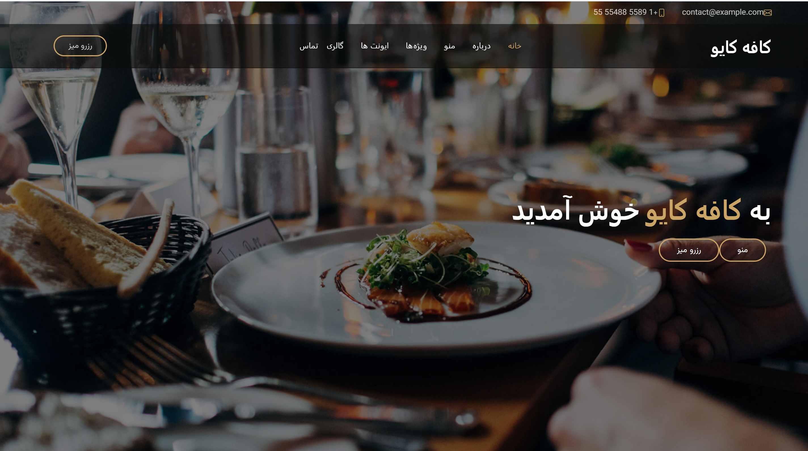

# 🚀 MAAT Holding Website

A modern, responsive corporate website designed for **MAAT Marketing & Communications Holding**. The project emphasizes a clean user interface, smooth animations, and an engaging user experience across all devices.

## 🌐 Live Demo

👉 **View the project here:**
https://[(https://pixelbysoroush.github.io/restaurant/index.html)]

---

## 📸 Preview




---

## ✨ Features

* 🎨 Modern & Professional UI
* 📱 Fully Responsive Design
* ⚡ Smooth Scrolling Experience
* 🎬 Scroll Animations with AOS
* 🖼️ Customer Logo Slider (Swiper.js)
* 🍔 Responsive Mobile Navigation
* 💼 Services Showcase
* 📂 Projects Section
* 📰 News & Articles
* 👥 Customer Brands Carousel
* 📞 Contact & Footer Section
* 🚀 Optimized Performance

---

## 🛠️ Built With

* HTML5
* CSS3
* Tailwind CSS
* JavaScript (ES6)
* Swiper.js
* AOS (Animate On Scroll)

---

## 📂 Project Structure

```text
.
├── assets/
│   ├── picture/
│   ├── css/
│   ├── js/
│   └── fonts/
├── index.html
└── README.md
```

---

## 🚀 Getting Started

Clone the repository:

```bash
git clone https://github.com/PixelBySoroush/maat.git
```

Navigate to the project folder:

```bash
cd maat
```

Open `index.html` in your browser or run the project using **Live Server**.

---

## 🎯 Project Goals

This project was developed to practice modern front-end development techniques by building a responsive corporate website with reusable components, interactive animations, and a clean, scalable layout.

---

## 📈 Future Improvements

* Contact Form Backend Integration
* Blog Management System
* SEO Optimization
* Dark Mode
* Multi-language Support
* Performance Optimization

---

## 👨‍💻 Author

**Soroush Reyvandi**

GitHub: https://github.com/PixelBySoroush

---

## ⭐ Support

If you like this project, don't forget to give it a ⭐ on GitHub.

---

## 📄 License

This project was created for educational and portfolio purposes.

All trademarks, logos, and brand assets belong to their respective owners.
